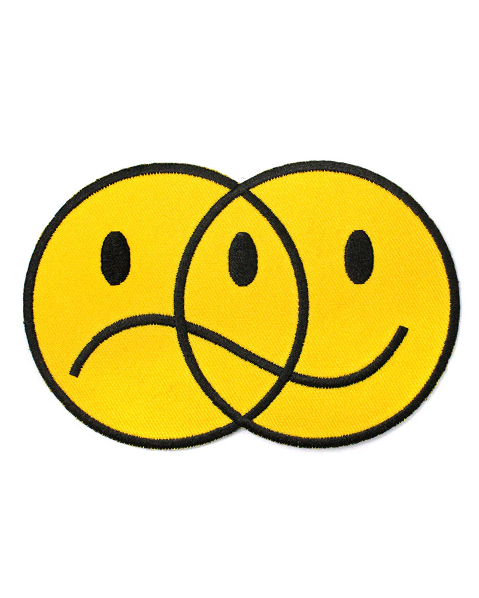

# Moodly



## Table of Contents

- [Overview](#overview)
- [Features](#features)
- [Installation](#installation)
- [Usage](#usage)
- [Contributing](#contributing)
- [License](#license)
- [Contact](#contact)

## Overview

**Moodly** is a web application that allows users to store and track their daily moods. The calendar dynamically changes colors based on your mood entries, helping you visualize your emotional patterns over time. Whether you want to monitor your mental well-being or simply reflect on your day, this tool makes it easy and engaging.

## Features

- 🎨 **Mood Color Coding**: Calendar dates change colors based on your mood.
- 📅 **Daily Mood Logging**: Easily record your mood for each day.
- 📊 **Mood History**: View your mood history in an intuitive calendar format.
- 📱 **Responsive Design**: Works seamlessly on both desktop and mobile devices.

## Installation

To get started with the Moodly, follow these steps:

1. Clone the repository:
   ```bash
   git clone https://github.com/zuhayrtariq/moodly.git
   ```
